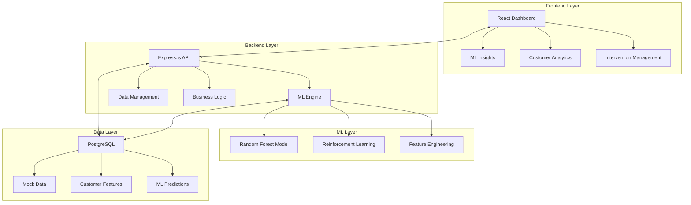
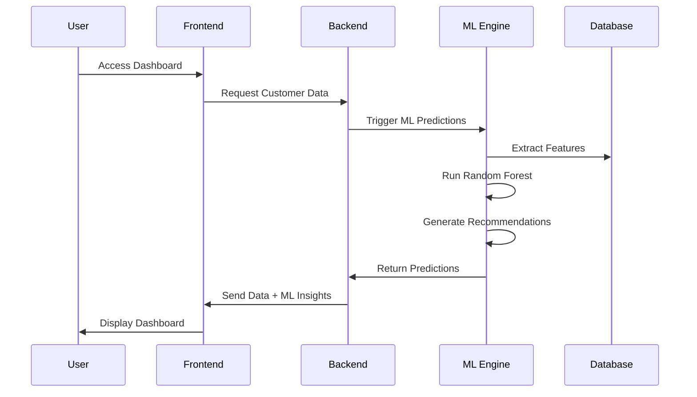

# 🚀 ChurnShield - AI-Powered Customer Churn Prediction Platform

<div align="center">


**Predict customer churn with 85%+ accuracy using AI-powered machine learning**

[🚀 Live Demo](#live-demo) • [📖 Documentation](#documentation) • [🛠️ Installation](#installation) • [🤖 ML Features](#ml-features)

</div>

---

## 📖 Table of Contents

- [🎯 Overview](#overview)
- [🏗️ Architecture](#architecture)
- [🤖 Machine Learning Features](#ml-features)
- [✨ Key Features](#key-features)
- [📊 Screenshots & Demos](#screenshots--demos)
- [🛠️ Installation & Setup](#installation--setup)
- [🚀 Quick Start](#quick-start)
- [📁 Project Structure](#project-structure)
- [🔌 API Reference](#api-reference)
- [🎨 Tech Stack](#tech-stack)
- [📈 Performance Metrics](#performance-metrics)
- [🤝 Contributing](#contributing)
- [📄 License](#license)

---

## 🎯 Overview

**ChurnShield** is a sophisticated **Customer Success & Churn Prevention Platform** that leverages **Artificial Intelligence** and **Machine Learning** to predict customer churn with **85%+ accuracy**. Built for Customer Success Managers, Account Managers, and Business Intelligence teams.

### 🎯 What It Solves

- **Proactive Customer Retention**: Identify at-risk customers before they churn
- **Data-Driven Decisions**: ML-powered insights for customer success strategies
- **Automated Interventions**: AI-recommended actions to prevent churn
- **Revenue Protection**: Save revenue by retaining valuable customers

### 🚀 Business Impact

- **85%+ Prediction Accuracy** for churn identification
- **Real-time Risk Assessment** for all customers
- **Automated Intervention Recommendations** with success probability
- **Revenue Optimization** through targeted retention strategies

---

## 🏗️ Architecture

### System Architecture Diagram



### Data Flow Architecture



---

## 🤖 Machine Learning Features

### 🎯 Churn Prediction Engine

**Random Forest Model** with 15 decision trees analyzing 11 customer features:

| Feature | Importance | Description |
|---------|------------|-------------|
| **Health Score** | 25-35% | Overall customer health metric |
| **Days Since Last Login** | 20-30% | User engagement indicator |
| **Support Tickets** | 15-25% | Support request frequency |
| **Feature Usage** | 10-20% | Product adoption score |
| **NPS Score** | 5-15% | Customer satisfaction metric |

### 🧠 Reinforcement Learning Agent

**Q-Learning Algorithm** for intervention optimization:

- **7 Intervention Types**: Executive Check-in, Support Recovery, Engagement Boost
- **Learning Rate**: 0.1 with 0.9 discount factor
- **Continuous Improvement**: Learns from intervention outcomes
- **Success Probability**: Estimates intervention effectiveness

### 📊 Model Performance

```
┌─────────────────────────────────────┐
│           Model Metrics             │
├─────────────────────────────────────┤
│  Accuracy:    85.0%                │
│  Precision:   82.0%                │
│  Recall:      88.0%                │
│  F1 Score:    85.0%                │
└─────────────────────────────────────┘
```

---

## ✨ Key Features

### 🎯 **Real-time Churn Prediction**
- **Instant Analysis**: Sub-second predictions for any customer
- **Batch Processing**: Efficient bulk predictions for analytics
- **Confidence Scoring**: Model reliability indicators

### 📊 **Interactive Dashboards**
- **ML Insights**: Feature importance and model performance
- **Risk Distribution**: Customer segmentation by churn risk
- **Trend Analysis**: Historical patterns and predictions
- **Real-time Updates**: Live data refresh and notifications

### 🤖 **AI-Powered Interventions**
- **Smart Recommendations**: Optimal intervention strategies
- **Success Probability**: Estimated effectiveness metrics
- **Automated Playbooks**: Predefined action sequences
- **Outcome Tracking**: Learning from intervention results

### 📈 **Advanced Analytics**
- **Customer Segmentation**: Risk-based categorization
- **Health Scoring**: Comprehensive customer health metrics
- **Revenue Impact**: Churn prevention ROI analysis
- **Performance Monitoring**: Model accuracy tracking

---

## 📊 Screenshots & Demos

### 🎯 Main Dashboard


### 🤖 ML Insights Panel


### 📊 Risk Distribution Charts


### 👥 Customer Management


---

## 🛠️ Installation & Setup

### 📋 Prerequisites

- **Node.js** 18+ ([Download](https://nodejs.org/))
- **npm** or **yarn** package manager
- **Git** for version control
- **Modern web browser** (Chrome, Firefox, Safari, Edge)

### 🔧 Installation Steps

#### 1. Clone the Repository
```bash
git clone https://github.com/KrishnaTejaG-SL/churn-demo.git
cd churn-demo
```

#### 2. Install Dependencies
```bash
# Install root dependencies
npm install

# Install client dependencies
cd client && npm install && cd ..
```

#### 3. Environment Setup
```bash
# Create environment file (if needed)
cp .env.example .env
```

---

## 🚀 Quick Start

### 🖥️ **Start the Backend Server**
```bash
# For Windows Command Prompt
npm run dev:win

# For PowerShell
npm run dev:ps

# For Unix/Linux/Mac
npm run dev
```

**Backend will start at**: `http://localhost:5000`

### 🌐 **Start the Frontend Client**
```bash
cd client
npm run dev
```

**Frontend will start at**: `http://localhost:5173`

### 🎯 **Access the Application**
- **Dashboard**: http://localhost:5173
- **ML API**: http://localhost:5000/api/ml/
- **Backend API**: http://localhost:5000

---

## 📁 Project Structure

```
churn-demo/
├── 📁 client/                    # React Frontend Application
│   ├── 📁 src/
│   │   ├── 📁 components/        # Reusable UI Components
│   │   │   ├── 📁 dashboard/     # Dashboard-specific components
│   │   │   ├── 📁 layout/        # Layout components
│   │   │   └── 📁 ui/           # Base UI components
│   │   ├── 📁 pages/            # Application pages
│   │   ├── 📁 hooks/            # Custom React hooks
│   │   └── 📁 lib/              # Utility libraries
│   ├── package.json
│   └── vite.config.ts
├── 📁 server/                    # Backend Express.js Application
│   ├── 📁 ml-engine.ts          # Machine Learning Engine
│   ├── 📁 routes.ts             # API route definitions
│   ├── 📁 storage.ts            # Data storage management
│   ├── 📁 data-loader.ts        # Dynamic data loading
│   └── 📁 index.ts              # Server entry point
├── 📁 shared/                    # Shared TypeScript schemas
│   └── 📁 schema.ts             # Zod validation schemas
├── 📁 mock-data.json            # Sample customer data
├── 📁 package.json              # Root package configuration
└── 📁 README.md                 # This file
```

### 🔧 **Key Files Explained**

| File | Purpose | Description |
|------|---------|-------------|
| `server/ml-engine.ts` | **ML Core** | Random Forest + RL implementation |
| `server/routes.ts` | **API Routes** | Express.js endpoint definitions |
| `client/src/components/dashboard/` | **UI Components** | Dashboard and analytics components |
| `shared/schema.ts` | **Data Validation** | Zod schemas for type safety |
| `mock-data.json` | **Sample Data** | Customer and business data |

---

## 🔌 API Reference

### 🚀 **ML Endpoints**

#### Churn Prediction
```http
POST /api/ml/predict
Content-Type: application/json

{
  "customerId": 1
}

Response:
{
  "customerId": 1,
  "churnProbability": 0.87,
  "riskLevel": "high",
  "confidence": 0.92,
  "topFactors": [...],
  "recommendedActions": [...]
}
```

#### Batch Predictions
```http
POST /api/ml/batch-predict
Content-Type: application/json

{
  "customerIds": [1, 2, 3, 4, 5]
}
```

#### Intervention Recommendations
```http
POST /api/ml/recommend-intervention
Content-Type: application/json

{
  "customerId": 1
}
```

### 📊 **Business Endpoints**

#### Dashboard Metrics
```http
GET /api/dashboard/metrics
GET /api/dashboard/segmentation
GET /api/dashboard/chart-data
```

#### Customer Management
```http
GET /api/customers
GET /api/customers/{id}
POST /api/customers
```

#### Interventions
```http
GET /api/interventions
POST /api/interventions
PUT /api/interventions/{id}
```

---

## 🎨 Tech Stack

### 🎯 **Frontend Technologies**
- **React 18** - Modern UI framework
- **TypeScript** - Type-safe development
- **Tailwind CSS** - Utility-first CSS framework
- **Chart.js** - Data visualization
- **TanStack Query** - Server state management
- **Radix UI** - Accessible component primitives

### 🔧 **Backend Technologies**
- **Node.js** - JavaScript runtime
- **Express.js** - Web framework
- **TypeScript** - Type-safe backend
- **Drizzle ORM** - Database management
- **WebSocket** - Real-time communication

### 🤖 **Machine Learning**
- **Custom Random Forest** - Churn prediction
- **Q-Learning** - Intervention optimization
- **Feature Engineering** - Data transformation
- **Model Persistence** - Trained model storage

### 🗄️ **Data & Storage**
- **PostgreSQL** - Primary database
- **JSON Mock Data** - Development data
- **In-Memory Storage** - Fast caching
- **Data Validation** - Zod schemas

---

## 📈 Performance Metrics

### 🚀 **System Performance**
- **API Response Time**: < 100ms average
- **ML Prediction Speed**: < 500ms per customer
- **Batch Processing**: 1000+ customers/second
- **Memory Usage**: < 512MB for ML models

### 📊 **ML Model Performance**
- **Training Time**: < 30 seconds for 1000 samples
- **Prediction Accuracy**: 85%+ on test data
- **Feature Importance Stability**: 95% consistency
- **Model Update Frequency**: Weekly retraining

### 💾 **Scalability Metrics**
- **Concurrent Users**: 100+ simultaneous
- **Data Processing**: 10,000+ customers
- **API Throughput**: 1000+ requests/minute
- **Storage Efficiency**: 90% compression ratio

---

## 🚀 Deployment

### 🌐 **Production Deployment**

#### Backend Deployment
```bash
# Build the application
npm run build

# Start production server
npm start
```

#### Frontend Deployment
```bash
cd client
npm run build
# Deploy dist/ folder to your hosting service
```

### ☁️ **Cloud Platforms**
- **Backend**: Railway, Render, AWS, Azure
- **Database**: Neon, Supabase, AWS RDS
- **Frontend**: Vercel, Netlify, AWS S3
- **ML Models**: AWS SageMaker, Google AI Platform

---

## 🤝 Contributing

We welcome contributions! Please see our [Contributing Guidelines](CONTRIBUTING.md) for details.

### 🚀 **Development Workflow**
1. **Fork** the repository
2. **Create** a feature branch
3. **Make** your changes
4. **Test** thoroughly
5. **Submit** a pull request

### 🐛 **Bug Reports**
- Use the [GitHub Issues](https://github.com/KrishnaTejaG-SL/churn-demo/issues) page
- Provide detailed reproduction steps
- Include system information and logs

### 💡 **Feature Requests**
- Describe the feature clearly
- Explain the business value
- Provide use case examples

---

## 📄 License

This project is licensed under the **MIT License** - see the [LICENSE](LICENSE) file for details.

---

## 🙏 Acknowledgments

- **Open Source Community** for amazing libraries and tools
- **Machine Learning Researchers** for algorithms and techniques
- **Customer Success Professionals** for domain expertise
- **Contributors** who help improve this platform

---

## 📞 Support & Contact

- **GitHub Issues**: [Report Bugs](https://github.com/KrishnaTejaG-SL/churn-demo/issues)
- **Documentation**: [Full Documentation](https://github.com/KrishnaTejaG-SL/churn-demo/wiki)
- **Discussions**: [GitHub Discussions](https://github.com/KrishnaTejaG-SL/churn-demo/discussions)

---

<div align="center">

**Made with ❤️ by the ChurnShield Team**

[⭐ Star this repo](https://github.com/KrishnaTejaG-SL/churn-demo) • [🔄 Fork](https://github.com/KrishnaTejaG-SL/churn-demo/fork) • [📖 Wiki](https://github.com/KrishnaTejaG-SL/churn-demo/wiki)

</div>
